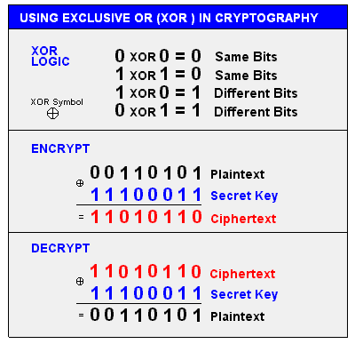

## XOR 
XOR compares two input bits and generates one output bit.  
If the bits are the same, the result is 0. If the bits are different, the result is 1.  
  
A ^ B = C -> C ^ B = A -> C ^ A = B  

## Byte
A byte is a group of 8 bits. A bit is the most basic unit and can be either 1 or 0.  
A byte is not just 8 values between 0 and 1, but 256 (28) different combinations (rather permutations) ranging from 00000000 via e.g. 01010101 to 11111111 .  
Thus, one byte can represent a decimal number between 0(00) and 255.